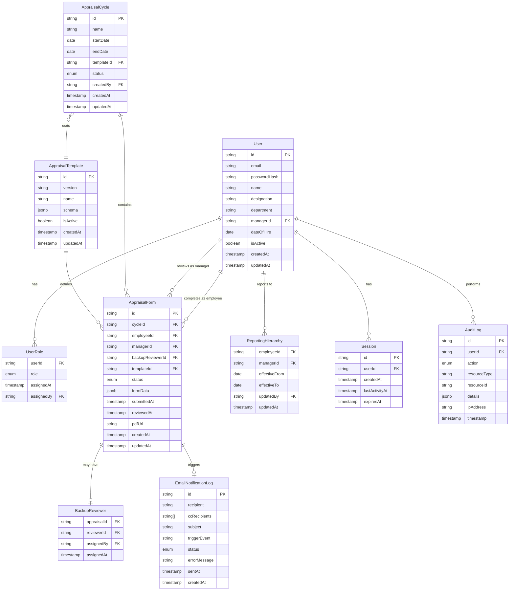

# Design Document: Employee Appraisal Cycle

## Overview

The Employee Appraisal Cycle application is a role-based web platform that manages the complete annual performance appraisal process for Think n Solutions (TnS). The system supports four distinct roles (Employee, Manager, HR, and Admin) and handles the full lifecycle from cycle configuration through employee self-appraisal and manager review to final completion and historical record-keeping.

The application is built as a modern web application with a clear separation between frontend presentation, backend business logic, and data persistence layers. The appraisal form structure is driven by a JSON schema stored in the database, allowing for flexibility and version control of form templates across different appraisal cycles.

### Key Design Goals

- Role-based access control with clear permission boundaries
- Dynamic form rendering from versioned JSON schemas
- Workflow state management with audit trails
- Scalable architecture supporting bulk operations
- Historical data preservation with template versioning
- Email notification system with delivery tracking

## Architecture

### System Architecture

The application follows a three-tier architecture:

```
┌─────────────────────────────────────────────────────────┐
│                     Frontend Layer                       │
│  (React/Vue.js SPA with role-based routing)             │
└─────────────────────────────────────────────────────────┘
                          │
                          │ HTTPS/REST API
                          │
┌─────────────────────────────────────────────────────────┐
│                    Backend Layer                         │
│  ┌──────────────┐  ┌──────────────┐  ┌──────────────┐ │
│  │ Auth Service │  │ Workflow Svc │  │ Notification │ │
│  └──────────────┘  └──────────────┘  └──────────────┘ │
│  ┌──────────────┐  ┌──────────────┐  ┌──────────────┐ │
│  │ Form Service │  │ PDF Service  │  │ Audit Service│ │
│  └──────────────┘  └──────────────┘  └──────────────┘ │
└─────────────────────────────────────────────────────────┘
                          │
                          │
┌─────────────────────────────────────────────────────────┐
│                   Data Layer                             │
│  ┌──────────────┐  ┌──────────────┐  ┌──────────────┐ │
│  │  PostgreSQL  │  │  File Store  │  │  Email Queue │ │
│  │   Database   │  │   (PDFs)     │  │   (Redis)    │ │
│  └──────────────┘  └──────────────┘  └──────────────┘ │
└─────────────────────────────────────────────────────────┘
```

### Technology Stack

- **Frontend**: React.js with TypeScript, React Router for routing, Redux/Context API for state management
- **Backend**: Node.js with Express.js or Python with FastAPI
- **Database**: PostgreSQL for relational data storage
- **Caching/Queue**: Redis for email queue and session management
- **File Storage**: Local filesystem or S3-compatible storage for PDF files
- **Email**: SMTP service (SendGrid, AWS SES, or similar)
- **PDF Generation**: Puppeteer (Node.js) or WeasyPrint (Python)

### Security Architecture

- Session-based authentication with HTTP-only cookies (POC environment uses HTTP)
- Role-based access control (RBAC) enforced at both API and UI layers
- Session timeout after 15 minutes of inactivity
- Audit logging for all significant actions
- Input validation and sanitization at API boundaries

## Components and Interfaces

### Frontend Components

#### 1. Authentication Module
- **LoginPage**: Handles user credential submission
- **SessionManager**: Manages session state, timeout, and redirects
- **ProtectedRoute**: HOC for route-level access control

#### 2. Dashboard Components
- **EmployeeDashboard**: Displays current and historical appraisals for employees
- **ManagerDashboard**: Shows team appraisal progress and pending reviews
- **HRDashboard**: Organization-wide metrics and cycle management
- **AdminDashboard**: User management and system configuration

#### 3. Form Components
- **DynamicFormRenderer**: Renders appraisal form from JSON schema
- **FormSection**: Reusable component for form sections (Key Responsibilities, IDP, etc.)
- **RatingInput**: Component for rating inputs (Excels/Exceeds/Meets/Developing or 1-10 scale)
- **FormStatusIndicator**: Visual indicator of form status

#### 4. Workflow Components
- **AppraisalFormView**: Main form view with role-based field access
- **ReviewInterface**: Manager review interface with side-by-side employee/manager views
- **BulkTriggerInterface**: HR interface for bulk cycle triggering

#### 5. Administrative Components
- **UserManagement**: CRUD interface for user accounts
- **RoleAssignment**: Interface for assigning/revoking roles
- **CycleConfiguration**: Interface for creating and configuring appraisal cycles
- **TemplateManager**: Interface for managing appraisal form templates
- **AuditLogViewer**: Interface for viewing and searching audit logs
- **EmailLogViewer**: Interface for viewing email notification status

### Backend Services

#### 1. Authentication Service
```typescript
interface AuthService {
  authenticate(credentials: Credentials): Promise<Session>;
  validateSession(sessionId: string): Promise<User | null>;
  invalidateSession(sessionId: string): Promise<void>;
  checkSessionTimeout(sessionId: string): Promise<boolean>;
}
```

#### 2. Authorization Service
```typescript
interface AuthorizationService {
  checkPermission(user: User, resource: string, action: string): Promise<boolean>;
  getUserRoles(userId: string): Promise<Role[]>;
  assignRole(userId: string, role: Role): Promise<void>;
  revokeRole(userId: string, role: Role): Promise<void>;
}
```

#### 3. Appraisal Cycle Service
```typescript
interface AppraisalCycleService {
  createCycle(config: CycleConfig): Promise<AppraisalCycle>;
  triggerCycle(cycleId: string, employeeIds: string[]): Promise<TriggerResult>;
  reopenAppraisal(appraisalId: string): Promise<void>;
  assignBackupReviewer(appraisalId: string, reviewerId: string): Promise<void>;
}
```

#### 4. Form Service
```typescript
interface FormService {
  getAppraisalForm(appraisalId: string, userId: string): Promise<AppraisalForm>;
  saveFormDraft(appraisalId: string, data: FormData): Promise<void>;
  submitForm(appraisalId: string, data: FormData): Promise<void>;
  getFormTemplate(templateId: string): Promise<FormTemplate>;
  renderForm(template: FormTemplate, data: FormData): Promise<RenderedForm>;
}
```

#### 5. Workflow Service
```typescript
interface WorkflowService {
  transitionState(appraisalId: string, newState: AppraisalState): Promise<void>;
  getAppraisalStatus(appraisalId: string): Promise<AppraisalState>;
  validateTransition(currentState: AppraisalState, newState: AppraisalState): boolean;
}
```

#### 6. Notification Service
```typescript
interface NotificationService {
  sendCycleTriggerNotification(employee: User, manager: User, cycleInfo: CycleInfo): Promise<void>;
  sendManagerNotification(manager: User, teamMembers: User[]): Promise<void>;
  sendReviewCompletionNotification(employee: User, manager: User, hr: User, pdfUrl: string): Promise<void>;
  logNotification(notification: NotificationLog): Promise<void>;
  getNotificationStatus(notificationId: string): Promise<NotificationStatus>;
}
```

#### 7. PDF Service
```typescript
interface PDFService {
  generateAppraisalPDF(appraisalId: string): Promise<PDFDocument>;
  storePDF(pdfDocument: PDFDocument, appraisalId: string): Promise<string>;
  retrievePDF(appraisalId: string): Promise<PDFDocument>;
}
```

#### 8. Audit Service
```typescript
interface AuditService {
  logAction(action: AuditAction): Promise<void>;
  queryAuditLog(filters: AuditFilters): Promise<AuditEntry[]>;
}
```

### API Endpoints

#### Authentication
- `POST /api/auth/login` - Authenticate user
- `POST /api/auth/logout` - Invalidate session
- `GET /api/auth/profile` - Get current user profile

#### Appraisal Cycles
- `POST /api/cycles` - Create new appraisal cycle (HR)
- `GET /api/cycles` - List appraisal cycles
- `POST /api/cycles/:id/trigger` - Trigger cycle for employees (HR)
- `POST /api/cycles/:id/reopen/:appraisalId` - Reopen appraisal (HR)

#### Appraisal Forms
- `GET /api/appraisals/:id` - Get appraisal form
- `PUT /api/appraisals/:id/draft` - Save draft
- `POST /api/appraisals/:id/submit` - Submit appraisal
- `POST /api/appraisals/:id/review` - Submit manager review
- `GET /api/appraisals/:id/pdf` - Download PDF

#### Dashboards
- `GET /api/dashboard/employee` - Employee dashboard data
- `GET /api/dashboard/manager` - Manager dashboard data
- `GET /api/dashboard/hr` - HR dashboard data

#### Administration
- `GET /api/admin/users` - List users
- `POST /api/admin/users` - Create user
- `PUT /api/admin/users/:id` - Update user
- `DELETE /api/admin/users/:id` - Delete user
- `POST /api/admin/users/:id/roles` - Assign role
- `DELETE /api/admin/users/:id/roles/:role` - Revoke role
- `GET /api/admin/audit-log` - Query audit log
- `GET /api/admin/email-log` - Query email notification log

## Data Models

### User
```typescript
interface User {
  id: string;
  email: string;
  passwordHash: string;
  name: string;
  designation: string;
  department: string;
  managerId: string | null;
  dateOfHire: Date;
  isActive: boolean;
  createdAt: Date;
  updatedAt: Date;
}
```

### Role
```typescript
enum Role {
  EMPLOYEE = 'EMPLOYEE',
  MANAGER = 'MANAGER',
  HR = 'HR',
  ADMIN = 'ADMIN'
}

interface UserRole {
  userId: string;
  role: Role;
  assignedAt: Date;
  assignedBy: string;
}
```

### AppraisalCycle
```typescript
interface AppraisalCycle {
  id: string;
  name: string; // e.g., "2025-26"
  startDate: Date;
  endDate: Date;
  templateId: string;
  status: 'DRAFT' | 'ACTIVE' | 'CLOSED';
  createdBy: string;
  createdAt: Date;
  updatedAt: Date;
}
```

### AppraisalTemplate
```typescript
interface AppraisalTemplate {
  id: string;
  version: string; // e.g., "V3.0"
  name: string;
  schema: FormSchema; // JSON schema defining form structure
  isActive: boolean;
  createdAt: Date;
  updatedAt: Date;
}

interface FormSchema {
  sections: FormSection[];
  ratingScales: RatingScale[];
}

interface FormSection {
  id: string;
  title: string;
  type: 'HEADER' | 'KEY_RESPONSIBILITIES' | 'IDP' | 'POLICIES' | 'GOALS' | 'SIGNATURE';
  fields: FormField[];
  minItems?: number;
  maxItems?: number;
}

interface FormField {
  id: string;
  label: string;
  type: 'TEXT' | 'TEXTAREA' | 'RATING' | 'DATE' | 'SELECT';
  required: boolean;
  editable: {
    employee: boolean;
    manager: boolean;
  };
  ratingScale?: string;
}

interface RatingScale {
  id: string;
  name: string;
  values: RatingValue[];
}

interface RatingValue {
  value: string | number;
  label: string;
  description?: string;
}
```

### AppraisalForm
```typescript
interface AppraisalForm {
  id: string;
  cycleId: string;
  employeeId: string;
  managerId: string;
  backupReviewerId: string | null;
  templateId: string;
  status: AppraisalStatus;
  formData: FormData;
  submittedAt: Date | null;
  reviewedAt: Date | null;
  pdfUrl: string | null;
  createdAt: Date;
  updatedAt: Date;
}

enum AppraisalStatus {
  NOT_STARTED = 'NOT_STARTED',
  DRAFT_SAVED = 'DRAFT_SAVED',
  SUBMITTED = 'SUBMITTED',
  UNDER_REVIEW = 'UNDER_REVIEW',
  REVIEW_DRAFT_SAVED = 'REVIEW_DRAFT_SAVED',
  REVIEWED_AND_COMPLETED = 'REVIEWED_AND_COMPLETED'
}

interface FormData {
  [sectionId: string]: {
    [fieldId: string]: any;
  };
}
```

### ReportingHierarchy
```typescript
interface ReportingHierarchy {
  employeeId: string;
  managerId: string;
  effectiveFrom: Date;
  effectiveTo: Date | null;
  updatedBy: string;
  updatedAt: Date;
}
```

### BackupReviewer
```typescript
interface BackupReviewer {
  appraisalId: string;
  reviewerId: string;
  assignedBy: string;
  assignedAt: Date;
}
```

### Session
```typescript
interface Session {
  id: string;
  userId: string;
  createdAt: Date;
  lastActivityAt: Date;
  expiresAt: Date;
}
```

### AuditLog
```typescript
interface AuditLog {
  id: string;
  userId: string;
  action: AuditAction;
  resourceType: string;
  resourceId: string;
  details: Record<string, any>;
  ipAddress: string;
  timestamp: Date;
}

enum AuditAction {
  LOGIN = 'LOGIN',
  LOGOUT = 'LOGOUT',
  FORM_DRAFT_SAVED = 'FORM_DRAFT_SAVED',
  FORM_SUBMITTED = 'FORM_SUBMITTED',
  REVIEW_DRAFT_SAVED = 'REVIEW_DRAFT_SAVED',
  REVIEW_COMPLETED = 'REVIEW_COMPLETED',
  ROLE_ASSIGNED = 'ROLE_ASSIGNED',
  ROLE_REVOKED = 'ROLE_REVOKED',
  CYCLE_CREATED = 'CYCLE_CREATED',
  CYCLE_TRIGGERED = 'CYCLE_TRIGGERED',
  APPRAISAL_REOPENED = 'APPRAISAL_REOPENED',
  USER_CREATED = 'USER_CREATED',
  USER_UPDATED = 'USER_UPDATED',
  USER_DELETED = 'USER_DELETED'
}
```

### EmailNotificationLog
```typescript
interface EmailNotificationLog {
  id: string;
  recipient: string;
  ccRecipients: string[];
  subject: string;
  triggerEvent: string;
  status: EmailStatus;
  errorMessage: string | null;
  sentAt: Date | null;
  createdAt: Date;
}

enum EmailStatus {
  PENDING = 'PENDING',
  SENT = 'SENT',
  FAILED = 'FAILED'
}
```

### Database Schema



## Correctness Properties

Property-based testing is partially applicable to this feature. While much of the system involves UI rendering, database CRUD, and side effects (which are not suitable for PBT), there are specific areas where universal properties can be validated:

1. **Workflow state transitions** - State machine logic
2. **Access control rules** - Permission checking logic
3. **Form validation** - Input validation rules

However, the following are NOT suitable for PBT and will use example-based tests instead:
- UI rendering and layout
- Database operations
- Email sending (side effects)
- PDF generation
- Dashboard aggregations

*A property is a characteristic or behavior that should hold true across all valid executions of a system—essentially, a formal statement about what the system should do. Properties serve as the bridge between human-readable specifications and machine-verifiable correctness guarantees.*


### Property Reflection

After analyzing all acceptance criteria, I identified the following potential properties:

1. Access control rules hold across all user-role-resource combinations (2.2)
2. Unauthorized access attempts are denied and logged (2.4)
3. Bulk form creation creates correct number of forms (3.3)
4. State transitions for reopening forms (3.6)
5. Historical cycles use correct template version (4.11)
6. Draft save state transitions (5.3)
7. Form submission state transitions (5.4)
8. Edit permissions based on form state (5.6)
9. Review draft save state transitions (6.3)
10. Review completion state transitions (6.4)

Redundancy Analysis:
- Properties 6, 7, 9, 10 all test state transitions and can be combined into a single comprehensive state machine property
- Property 4 (reopening) is also a state transition and can be included in the state machine property
- Properties 1 and 2 both test access control and can be combined
- Property 8 (edit permissions) is a specific case of access control based on state

Consolidated Properties:
1. **Access Control Property**: Combines properties 1, 2, and 8 - tests that access control rules are enforced correctly across all user-role-resource-state combinations
2. **State Machine Property**: Combines properties 4, 6, 7, 9, 10 - tests that all state transitions follow valid paths
3. **Bulk Form Creation Property**: Property 3 - tests bulk operations create correct number of forms
4. **Template Versioning Property**: Property 5 - tests historical cycles use correct template versions

### Property 1: Access Control Enforcement

*For any* user with a given set of roles, resource (API endpoint or UI component), and appraisal form state, the system SHALL grant or deny access according to the defined access control rules, and SHALL log any denied access attempts to the audit log.

**Validates: Requirements 2.2, 2.4, 5.6**

Access control rules:
- Employees can edit their own appraisal forms only in NOT_STARTED or DRAFT_SAVED states
- Managers can edit appraisal forms for their direct reports only in SUBMITTED, UNDER_REVIEW, or REVIEW_DRAFT_SAVED states
- HR can access all appraisal forms in any state
- Admin can access all system resources
- Backup reviewers have the same permissions as the primary manager for assigned appraisals

### Property 2: State Machine Validity

*For any* appraisal form in a given state, only valid state transitions SHALL be allowed, and invalid transitions SHALL be rejected.

**Validates: Requirements 3.6, 5.3, 5.4, 6.3, 6.4**

Valid state transitions:
- NOT_STARTED → DRAFT_SAVED (employee saves draft)
- NOT_STARTED → SUBMITTED (employee submits without draft)
- DRAFT_SAVED → SUBMITTED (employee submits after draft)
- SUBMITTED → UNDER_REVIEW (manager opens for review)
- UNDER_REVIEW → REVIEW_DRAFT_SAVED (manager saves review draft)
- REVIEW_DRAFT_SAVED → REVIEWED_AND_COMPLETED (manager completes review)
- UNDER_REVIEW → REVIEWED_AND_COMPLETED (manager completes without draft)
- Any state → NOT_STARTED (HR reopens form)

Invalid transitions (examples):
- SUBMITTED → DRAFT_SAVED
- REVIEWED_AND_COMPLETED → UNDER_REVIEW (without HR reopen)
- NOT_STARTED → REVIEWED_AND_COMPLETED

### Property 3: Bulk Form Creation Correctness

*For any* set of N eligible employees and an active appraisal template, triggering an appraisal cycle SHALL create exactly N appraisal form records, each associated with the correct employee, their manager, and the active template.

**Validates: Requirements 3.3**

### Property 4: Template Version Consistency

*For any* historical appraisal form, the system SHALL retrieve and use the appraisal template version that was active at the time the form was created, not the currently active template version.

**Validates: Requirements 4.11**

## Error Handling

### Authentication Errors
- Invalid credentials: Return 401 Unauthorized with error message
- Session timeout: Return 401 Unauthorized and redirect to login
- Missing session: Return 401 Unauthorized and redirect to login

### Authorization Errors
- Insufficient permissions: Return 403 Forbidden with error message
- Log unauthorized access attempts to audit log

### Validation Errors
- Invalid form data: Return 400 Bad Request with field-level error messages
- Missing required fields: Return 400 Bad Request with list of missing fields
- Invalid state transitions: Return 409 Conflict with error message

### Business Logic Errors
- Cycle already triggered: Return 409 Conflict
- Form already submitted: Return 409 Conflict
- Template not found: Return 404 Not Found
- User not found: Return 404 Not Found

### System Errors
- Database connection failure: Return 503 Service Unavailable
- Email service failure: Log error, queue for retry, return 202 Accepted
- PDF generation failure: Log error, return 500 Internal Server Error

### Error Logging
- All errors SHALL be logged with timestamp, user ID, action, and error details
- Critical errors (database failures, authentication issues) SHALL trigger alerts
- Email failures SHALL be logged to EmailNotificationLog with failure status

## Testing Strategy

### Unit Testing

Unit tests will focus on:
- Business logic functions (state transition validation, access control rules)
- Data validation and transformation functions
- Utility functions (date calculations, string formatting)
- Service layer methods with mocked dependencies

Example unit tests:
- Validate state transition logic with specific state pairs
- Test access control rules with specific user-role-resource combinations
- Test form validation with valid and invalid inputs
- Test email template rendering with sample data
- Test PDF generation with sample form data

### Property-Based Testing

Property-based tests will validate universal properties across randomized inputs using a PBT library (fast-check for TypeScript/JavaScript or Hypothesis for Python).

Each property test will:
- Run minimum 100 iterations with randomized inputs
- Reference the design document property in a comment tag
- Use generators to create valid test data (users, roles, states, forms)

**Property Test 1: Access Control Enforcement**
```typescript
// Feature: employee-appraisal-cycle, Property 1: Access Control Enforcement
fc.assert(
  fc.property(
    userGenerator(),
    roleSetGenerator(),
    resourceGenerator(),
    appraisalStateGenerator(),
    (user, roles, resource, state) => {
      const hasAccess = authService.checkAccess(user, roles, resource, state);
      const expectedAccess = computeExpectedAccess(user, roles, resource, state);
      
      if (!hasAccess && expectedAccess === false) {
        // Verify audit log entry was created
        const auditEntry = auditService.getLatestEntry(user.id);
        expect(auditEntry.action).toBe('ACCESS_DENIED');
      }
      
      return hasAccess === expectedAccess;
    }
  ),
  { numRuns: 100 }
);
```

**Property Test 2: State Machine Validity**
```typescript
// Feature: employee-appraisal-cycle, Property 2: State Machine Validity
fc.assert(
  fc.property(
    appraisalStateGenerator(),
    appraisalStateGenerator(),
    (fromState, toState) => {
      const isValidTransition = workflowService.isValidTransition(fromState, toState);
      const expectedValidity = VALID_TRANSITIONS[fromState]?.includes(toState) || toState === 'NOT_STARTED';
      
      return isValidTransition === expectedValidity;
    }
  ),
  { numRuns: 100 }
);
```

**Property Test 3: Bulk Form Creation Correctness**
```typescript
// Feature: employee-appraisal-cycle, Property 3: Bulk Form Creation Correctness
fc.assert(
  fc.property(
    fc.array(employeeGenerator(), { minLength: 1, maxLength: 100 }),
    templateGenerator(),
    async (employees, template) => {
      const cycle = await cycleService.createCycle({ templateId: template.id });
      const result = await cycleService.triggerCycle(cycle.id, employees.map(e => e.id));
      
      expect(result.formsCreated).toBe(employees.length);
      
      const forms = await formService.getFormsByCycle(cycle.id);
      expect(forms.length).toBe(employees.length);
      
      forms.forEach(form => {
        expect(form.templateId).toBe(template.id);
        const employee = employees.find(e => e.id === form.employeeId);
        expect(employee).toBeDefined();
        expect(form.managerId).toBe(employee.managerId);
      });
      
      return true;
    }
  ),
  { numRuns: 100 }
);
```

**Property Test 4: Template Version Consistency**
```typescript
// Feature: employee-appraisal-cycle, Property 4: Template Version Consistency
fc.assert(
  fc.property(
    historicalAppraisalGenerator(),
    async (appraisal) => {
      const retrievedTemplate = await formService.getTemplateForAppraisal(appraisal.id);
      
      expect(retrievedTemplate.id).toBe(appraisal.templateId);
      expect(retrievedTemplate.version).toBe(appraisal.templateVersion);
      
      // Verify it's not using the currently active template if versions differ
      const activeTemplate = await templateService.getActiveTemplate();
      if (activeTemplate.version !== appraisal.templateVersion) {
        expect(retrievedTemplate.id).not.toBe(activeTemplate.id);
      }
      
      return true;
    }
  ),
  { numRuns: 100 }
);
```

### Integration Testing

Integration tests will verify:
- API endpoints with database interactions
- Authentication and session management
- Email notification sending (with mocked SMTP)
- PDF generation and storage
- Dashboard data aggregation
- Bulk operations
- Historical data access

Example integration tests:
- Test complete appraisal workflow from creation to completion
- Test cycle triggering with email notifications
- Test manager review workflow
- Test HR dashboard metrics calculation
- Test historical appraisal access with correct template versions

### End-to-End Testing

E2E tests will verify complete user workflows:
- Employee login, complete self-appraisal, submit
- Manager login, review appraisal, complete review
- HR login, create cycle, trigger for employees, monitor progress
- Admin login, manage users, assign roles, view audit logs

### Performance Testing

Performance tests will verify:
- Bulk cycle triggering for 1000+ employees completes within acceptable time
- Dashboard loading time with large datasets
- Concurrent user access handling
- Database query performance with indexes

### Security Testing

Security tests will verify:
- Session timeout enforcement
- Access control enforcement
- SQL injection prevention
- XSS prevention
- CSRF protection (when HTTPS is enabled)
- Audit logging completeness

## Implementation Notes

### Phase 1: Core Infrastructure
1. Database schema setup
2. Authentication and session management
3. Role-based access control
4. Audit logging

### Phase 2: Appraisal Management
1. Template management
2. Cycle creation and configuration
3. Form rendering from JSON schema
4. Employee self-appraisal workflow
5. State machine implementation

### Phase 3: Review and Completion
1. Manager review workflow
2. PDF generation
3. Email notifications
4. Completion workflow

### Phase 4: Dashboards and Reporting
1. Employee dashboard
2. Manager dashboard
3. HR dashboard
4. Historical access

### Phase 5: Administration
1. User management
2. Role assignment
3. Audit log viewer
4. Email log viewer
5. System configuration

### Technology Considerations

**Frontend Framework**: React.js is recommended for its component-based architecture, which aligns well with the dynamic form rendering requirements.

**Backend Framework**: Node.js with Express.js or Python with FastAPI are both suitable. Node.js may be preferable if the team has JavaScript expertise and wants to share code/types between frontend and backend.

**Database**: PostgreSQL is recommended for its robust JSONB support (for form schemas and data), transaction support, and mature ecosystem.

**PDF Generation**: Puppeteer (Node.js) or WeasyPrint (Python) can generate PDFs from HTML templates. Consider using a template engine (Handlebars, Jinja2) for PDF layouts.

**Email Service**: Use a transactional email service (SendGrid, AWS SES) with webhook support for delivery tracking.

**Session Management**: Use Redis for session storage to support horizontal scaling and fast session lookups.

### Deployment Considerations

- Use environment variables for configuration (database URLs, email credentials, etc.)
- Implement health check endpoints for monitoring
- Use database migrations for schema changes
- Implement backup and restore procedures for database
- Set up monitoring and alerting for critical errors
- Use containerization (Docker) for consistent deployments
- Implement CI/CD pipeline for automated testing and deployment

### Future Enhancements

- Multi-language support for international teams
- Mobile app for on-the-go appraisal access
- Integration with HR systems (Workday, BambooHR)
- Advanced analytics and reporting
- Goal tracking throughout the year
- 360-degree feedback support
- Competency framework management
- Automated reminders for pending appraisals
- Export to various formats (Excel, CSV)
- Custom report builder for HR
